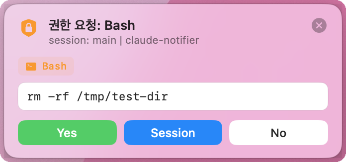
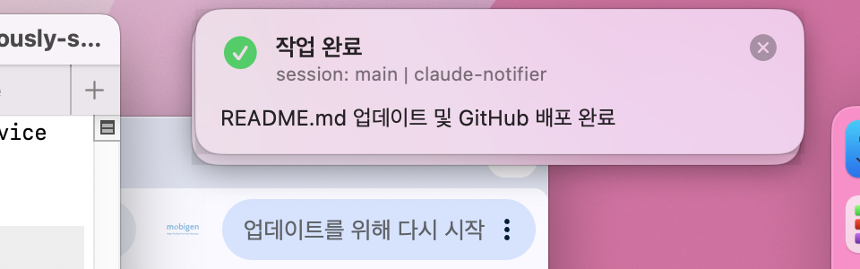
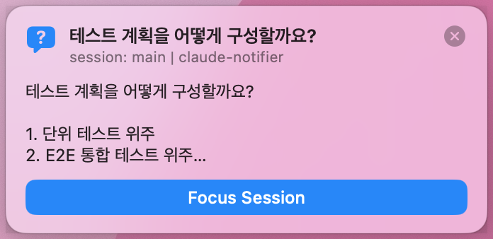

# ClaudeNotifier

macOS에서 [Claude Code](https://claude.ai/code)를 Terminal + tmux 환경으로 사용할 때,  
권한 요청 / 작업 완료 / 질문 알림을 **커스텀 플로팅 배너**로 표시해주는 시스템입니다.

배너 버튼으로 권한 응답을 Claude Code에 직접 전달하고,  
질문·완료 배너를 클릭하면 해당 tmux 세션으로 자동 포커스됩니다.

📋 [변경 이력 (Changelog)](docs/changelog.html)

---

## 배너 종류

| 배너 | 트리거 | 동작 |
|------|--------|------|
| **권한 요청** | `PreToolUse` hook | Yes / Session / No 버튼으로 응답 → Claude Code에 전달 |
| **작업 완료** | `Stop` hook | 완료 메시지 표시, 클릭 시 터미널 포커스 |
| **질문** | `Notification` hook | 질문 요약 표시, 클릭 시 터미널 포커스 |

### 권한 요청 배너


### 작업 완료 배너


### 질문 배너


---

## 특징

- **터미널 포커스 시 자동 소멸** — 터미널로 전환하면 배너가 자동으로 닫힘 (1.5초 이내)
- **정밀 탭 감지** — 터미널 앱이 전면이어도 Claude Code가 실행 중인 바로 그 탭/세션이 보일 때만 배너 생략, 다른 탭이면 배너 표시
- **알림 필터** — "Claude is waiting" 계열 상태 메시지는 배너 미표시
- **소리 없음** — 어떤 사운드도 재생하지 않음
- **스택형** — 여러 에이전트 실행 시 배너가 우상단에 겹겹이 쌓임
- **Fail-open** — 앱 미실행 / 타임아웃 시 Claude Code 기본 프롬프트로 폴백
- **정밀 tmux 포커스** — pane의 TTY 역조회로 정확한 session:window.pane 이동 + Terminal.app 탭 선택
- **Session 허용 보장** — hook 타임아웃 후 클릭해도 앱이 직접 세션 캐시를 기록해 다음 요청부터 배너 생략

---

## 아키텍처

```
Claude Code ──hook stdin JSON──▶ notify-hook.sh ──HTTP POST /event──▶ ClaudeNotifier 앱
                                       │                                      │
                                       │                               플로팅 배너 표시
                                       │                                      │
                                       ◀──HTTP GET /response/{id} (long-poll)─┘
                                                   사용자 버튼 클릭
                                       │
                                       ▼
              PreToolUse permissionDecision ──▶ Claude Code 허용/차단
```

- **PreToolUse**: 배너 표시 후 사용자 클릭을 long-poll로 대기 → `permissionDecision`(allow/deny) 반환  
- **Stop / Notification**: fire-and-forget, 응답 불필요

---

## 구성 요소

| 경로 | 역할 |
|------|------|
| `Sources/ClaudeNotifier/*.swift` | SwiftUI 액세서리 앱 — BSD 소켓 HTTP 서버 + NSPanel 배너 |
| `scripts/notify-hook.sh` | Claude Code hook 디스패처 (PreToolUse / Stop / Notification) |
| `scripts/run-app.sh` | 앱 빌드 + 백그라운드 실행 |
| `scripts/install-hooks.sh` | `~/.claude/settings.json`에 hook 등록 |
| `scripts/install-launchagent.sh` | LaunchAgent로 앱 자동 시작 등록 |
| `scripts/uninstall-hooks.sh` | notifier hook 제거 |
| `scripts/uninstall-launchagent.sh` | LaunchAgent 제거 |

---

## 요구사항

- macOS 13 Ventura 이상
- Swift 5.9 이상 (`xcode-select --install`)
- Terminal.app 또는 iTerm2
- tmux (선택)

---

## 설치

```bash
# 1. 저장소 클론
git clone https://github.com/uri010/claude-notifier.git
cd claude-notifier

# 2. 앱 빌드 & 실행
./scripts/run-app.sh

# 3. hook 설치
./scripts/install-hooks.sh

# 4. Claude Code 세션 재시작 (hook 재로딩)
```

LaunchAgent로 macOS 로그인 시 자동 시작하려면:

```bash
./scripts/install-launchagent.sh
```

---

## hook 매처 설정

기본값은 `Bash|Write|Edit|MultiEdit|NotebookEdit` 도구만 게이트합니다.  
모든 도구를 게이트하려면:

```bash
./scripts/install-hooks.sh --all
```

---

## HTTP API

앱은 `localhost:47823` (기본값)에서 HTTP 서버를 실행합니다.

| 메서드 | 경로 | 설명 |
|--------|------|------|
| `GET`  | `/health` | `{status, pending, version}` |
| `POST` | `/event` | 이벤트 등록 → `{id}` 반환 (blocking 배너) |
| `GET`  | `/response/{id}?timeout=N` | 결정 long-poll → `{decision}` |
| `POST` | `/notify` | 알림 배너 표시 (fire-and-forget) |
| `POST` | `/respond/{id}` | 외부에서 결정 주입 (테스트용) |
| `POST` | `/clear` | 모든 배너 제거 |

`decision` 값: `allow` · `allowSession` · `deny` · `dismiss` · `focus` · `timeout`

---

## 환경 변수

| 변수 | 기본값 | 설명 |
|------|--------|------|
| `CLAUDE_NOTIFIER_PORT` | `47823` | HTTP 서버 포트 |
| `CLAUDE_NOTIFIER_WAIT` | `45` | PreToolUse 응답 대기 시간(초) |

---

## 로그

| 대상 | 위치 |
|------|------|
| 앱 로그 | `~/.claude-notifier/notifier.log` |
| hook 로그 | stderr (`[notify-hook] ...`) |

---

## 제거

```bash
./scripts/uninstall-hooks.sh
./scripts/uninstall-launchagent.sh   # LaunchAgent 설치한 경우
```
